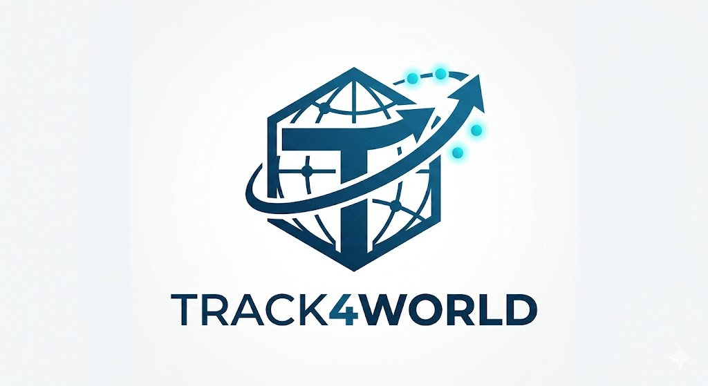

<div align="center">
</img>
</div>

<h3 align="center"><strong>Track4World: Feedforward World-centric Dense 3D Tracking of All Pixels</strong></h3>
<p align="center">
  <a href="https://github.com/jiah-cloud">Jiahao Lu</a><sup>1</sup>,</span>
  <a href="https://openreview.net/profile?id=~Jiayi_Xu10">Jiayi Xu</a><sup>1</sup>,</span>
  <a href="https://wbhu.github.io/">Wenbo Hu</a><sup>2†</sup>,</span>
  <a href="https://ruijiezhu94.github.io/ruijiezhu/">Ruijie Zhu</a><sup>2</sup>,</span>
  <a href="https://afterjourney00.github.io/">Chengfeng Zhao</a><sup>1</sup>,</span><br>
  <a href="https://saikit.org/index.html">Sai-Kit Yeung</a><sup>1</sup>,</span>
  <a href="https://scholar.google.com/citations?user=4oXBp9UAAAAJ&hl=en">Ying Shan</a><sup>2</sup>,</span>
  <a href="https://liuyuan-pal.github.io/">Yuan Liu</a><sup>1†</sup>
  <br>
  <sup>1</sup> HKUST </span> 
  <sup>2</sup> ARC Lab, Tencent PCG </span>
  <br>
</p>

<div align="center">
  <a href='https://arxiv.org/abs/2603.02573'></a> &nbsp;&nbsp;&nbsp;&nbsp;&nbsp;
  <a href='assets/arxiv_Track4World.pdf'></a> &nbsp;&nbsp;&nbsp;&nbsp;&nbsp;
  <a href='https://jiah-cloud.github.io/Track4World.github.io/'></a> &nbsp;&nbsp;&nbsp;&nbsp;&nbsp;
  <a href='https://huggingface.co/TencentARC/Track4World'></a> &nbsp;&nbsp;&nbsp;&nbsp;&nbsp; 
  <a href='https://huggingface.co/TencentARC/Track4World/blob/main/LICENSE.txt'></a> &nbsp;&nbsp;&nbsp;&nbsp;&nbsp;
  <br>
  <br>
</div>


---

### 🖼️ Framework

<div align="center">
  
</div>

**Track4World** estimates dense 3D scene flow of every pixel between arbitrary frame pairs from a monocular video in a global feedforward manner, enabling efficient and dense 3D tracking of every pixel in the world-centric coordinate system.

---

## ⚙️ Setup and Installation

### 1. Clone the Repository

Clone the repository with submodules to ensure all dependencies are included:

```bash
git clone --recursive https://github.com/TencentARC/Track4World.git
cd Track4World
```

### 2. Environment Setup

We provide an installation script tested with **CUDA 12.1** and **Python 3.11**.

```bash
# Create and activate environment
conda create -n track4world python=3.11
conda activate track4world

# Install PyTorch
pip install torch==2.5.1 torchvision==0.20.1 torchaudio==2.5.1 --index-url https://download.pytorch.org/whl/cu121

# Install dependencies
pip install -r requirements.txt
```

### 3. Install Third-Party Modules

We utilize several external repositories. Please run the following commands to set them up correctly:

```bash
# Install utils3d
git clone https://github.com/jiah-cloud/utils3d.git 

# Setup Pi3 (Sparse checkout)
git clone --no-checkout https://github.com/yyfz/Pi3.git track4world/nets/external/pi3_repo
cd track4world/nets/external/pi3_repo
git sparse-checkout init
git sparse-checkout set pi3
git checkout main
find . -maxdepth 1 -type f -exec rm -f {} \;
mv pi3 ../pi3
cd ../../../..

# Setup Grounded-SAM-2
git clone https://github.com/IDEA-Research/Grounded-SAM-2.git submodules
cd submodules
pip install -e .
pip install --no-build-isolation -e grounding_dino
cd ..
```

### 4. Download Weights

Download the pre-trained model weights and place them in the `checkpoints/` directory.

```bash
mkdir -p checkpoints

# Download SAM2 weights
wget https://dl.fbaipublicfiles.com/segment_anything_2/092824/sam2.1_hiera_large.pt -O ./checkpoints/sam2.1_hiera_large.pt

# Download Track4World weights
wget https://huggingface.co/TencentARC/Track4World/resolve/main/track4world_da3.pth -O ./checkpoints/track4world_da3.pth
wget https://huggingface.co/TencentARC/Track4World/resolve/main/track4world_pi3.pth -O ./checkpoints/track4world_pi3.pth
wget https://huggingface.co/TencentARC/Track4World/resolve/main/track4world_moge.pth -O ./checkpoints/track4world_moge.pth
```

* **Manual Download:** [HuggingFace Link](https://huggingface.co/TencentARC/Track4World)

---

## 🚀 Demo

Run the following commands to perform tracking and reconstruction on the provided demo video (`demo_data/cat.mp4`).

### 1. First Frame 3D Tracking (`3d_ff`)

Reconstructs 3D motion based on the geometry of the first frame.

```bash
python demo.py \
    --mp4_path demo_data/cat.mp4 \
    --mode 3d_ff \
    --Ts -1 \
    --save_base_dir results/cat
```

### 2. Dense Tracking: Every Pixel, Every Frame (`3d_efep`)

Performs dense 3D tracking for every pixel across all frames.

**Option A: Camera-Centric Coordinate System**
```bash
python demo.py \
    --mp4_path demo_data/cat.mp4 \
    --coordinate world_depthanythingv3 \
    --mode 3d_efep \
    --Ts -1 \
    --ckpt_init checkpoints/track4world_da3.pth \
    --save_base_dir results/cat
```

**Option B: World-Centric Coordinate System**

For world-centric reconstruction, you can also directly run **Step 2** to obtain world-centric 3D tracking results. However, for better visualization, especially to clearly separate foreground and background objects,it is recommended to first segment dynamic objects using DINO and SAM2 in **Step 1**. You can use either `world_depthanythingv3` or `world_pi3` for world coordinate system.

```bash
# 1. DINO + SAM2 Segmentation
# Use --text-prompt to specify the dynamic objects in your video (e.g., "cat.", "person.", "car.").
python scripts/run_dino_sam2.py \
    --video-path demo_data/cat.mp4 \
    --sam2-checkpoint checkpoints/sam2.1_hiera_large.pt \
    --output-dir results/cat \
    --text-prompt "cat."
    
# 2. Run Track4World 3D EFEP
python demo.py \
    --mp4_path demo_data/cat.mp4 \
    --coordinate world_depthanythingv3 \
    --mode 3d_efep \
    --Ts -1 \
    --ckpt_init checkpoints/track4world_da3.pth \
    --save_base_dir results/cat
```

### 3. 2D Tracking (`2d`)

Performs standard 2D tracking in image space.

```bash
python demo.py \
    --mp4_path demo_data/cat.mp4 \
    --mode 2d \
    --Ts -1 \
    --save_base_dir results/cat
```

---

## ✨ Visualization

Visualize the dense 4D trajectories and reconstructed scenes using the generated output files.

**Visualize First Frame 3D Tracking:**

```bash
python visualization/vis_3d_ff.py --ply_dir results/cat/3d_ff_output
```

**Visualize Dense Tracking (Every Pixel):**

```bash
# Camera Centric Visualization
python visualization/vis_3d_efep.py --ply_dir results/cat/3d_efep_output

# World Centric Visualization (Foreground-Background Separation, Static Background)
python visualization/vis_3d_efep_world.py --ply_dir results/cat/3d_efep_output
```

<div align="center">
  
</div>

---

## 📊 Evaluation

For detailed instructions on how to evaluate the model on standard benchmarks (Sintel, KITTI, Kubric, etc.), please refer to the evaluation guide:

👉 **[Evaluation Guide (evaluation/eval.md)](evaluation/eval.md)**

---

## 📝 Citation

If you find **Track4World** useful for your research or applications, please consider citing our paper:

```bibtex

```

---

## 🤝 Acknowledgements

Our codebase is built upon [MoGe](https://github.com/microsoft/MoGe), [Alltracker](https://github.com/aharley/alltrackerh), [Pi3](https://github.com/yyfz/Pi3), and [Depth Anything 3](https://github.com/ByteDance-Seed/Depth-Anything-3). We also gratefully acknowledge [TrackingWorld](https://github.com/IGL-HKUST/TrackingWorld) and [VGGT](https://github.com/facebookresearch/vggt) for their excellent work!
